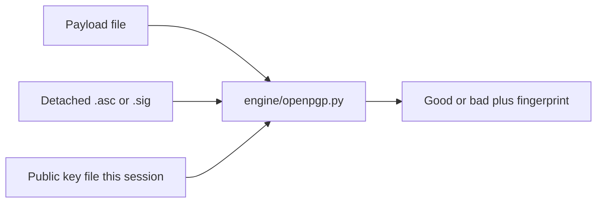

# Secret Kit — Detached OpenPGP verify on Verify

**Date:** 2026-09-11  
**Status:** written for review; implement after this spec is approved  
**Depends on:** none (Verify card). Independent of [2026-09-11-seed-write-down-check-design.md](2026-09-11-seed-write-down-check-design.md) and [2026-09-11-ssh-age-keys-design.md](2026-09-11-ssh-age-keys-design.md). Ed25519 verify may share `engine/ed25519.py` if that file already exists when this ships; otherwise a tiny twin in `engine/openpgp.py` is allowed.  
**Constraints:** no vault, nothing saved, loopback-only, `os.urandom` remains the CSPRNG, clipboard still clears after 60s. After ship: `bash scripts/build-all.sh`. AppImage site-packages stay small: **do not add `cryptography`, PyNaCl, or `pgpy`. Do not shell out to `gpg`/`gpgv`.**

## Goal

On Verify, check that a downloaded file is the exact payload a detached OpenPGP signature covers, and that the signature was made by a key **inside a public-key file the user supplies this session**. Motivating case: `tor-browser-macos-15.0.22.dmg` + `tor-browser-macos-15.0.22.dmg.asc`. The `.asc` is not hex and must not go in the File checksum box.

## Non-goals (this pass)

- Clearsigned text, inline signed messages, or attached (one-file) signatures.
- Encrypt, decrypt, or generate OpenPGP keys.
- Bundling the Tor (or any) public key in the app.
- Keyservers, WKD, `gpg --locate-keys`, or any network lookup.
- A persistent keyring on disk.
- OpenPGP v3 packets, DSA, ElGamal, ECDSA-on-NIST, SHA-1 signatures as a success path.
- Web of trust, ownertrust, or “this key is in Debian.”
- Raising HTTP `MAX_BODY` so a 169 MB `.dmg` can upload.
- Embedding CPython, Windows `.exe`, or Apple notarization.

---

## 1. Why a new card

File checksum in [ui/index.html](ui/index.html) wants vendor **hex** (MD5 / SHA-1 / SHA-256 / SHA-512). A Tor `.asc` is:

```
-----BEGIN PGP SIGNATURE-----
…
-----END PGP SIGNATURE-----
```

That is a detached signature over the payload bytes. A match means: this key signed this file. It does not mean Secret Kit vouches for Tor.

Checksum, compare two files, hash a folder, and BIP-39 stay unchanged. New card **OpenPGP signature** sits **immediately under File checksum**.



---

## 2. Approach (locked: C)

| | Approach | Why not / why |
| --- | --- | --- |
| A | Shell out to `gpg` / `gpgv` | Matches Tor’s docs. AppImage, Docker, and Windows pocket builds do not ship GnuPG. Reject. |
| B | `pgpy` + `cryptography` | Handles subkeys. Pulls OpenSSL into the AppImage (today: ecdsa + six). Reject for v1. |
| C | **In-process verify-only** | Parse OpenPGP packets in Python. RSA verify with stdlib `pow`. Ed25519 via `engine/ed25519.py` if present, else a twin. Stream the payload with `hashlib`. No GnuPG, no `cryptography`. |

---

## 3. Trust model

Three inputs **this session only**:

1. **Payload** — the download (`.dmg`, `.tar.xz`, installer, …).
2. **Detached signature** — `.asc` (armored) or `.sig` / binary signature packet(s).
3. **Public key** — armored `BEGIN PGP PUBLIC KEY BLOCK` or binary OpenPGP key material. May contain a primary key plus signing subkeys (Tor’s usual shape).

Secret Kit does not fetch keys. A good result is **not** “this is Tor.” It is “the signature is mathematically valid for a key in the file you chose.”

**Match rule**

The verifier lives in the app tree (`engine/openpgp.py`). The public key is never shipped in `data/`. Do not bundle vendor keys.

1. Parse every public primary key and signing subkey from the supplied key file.
2. Read the signature’s issuer key ID (or fingerprint).
3. If that ID is not among those keys: fail. Error: `This signature was not made by the key file you supplied.`
4. Hash the payload with the hash algorithm named in the signature (v1: SHA-256 or SHA-512 only).
5. Verify the signature bytes with that key (RSA PKCS#1 v1.5 or Ed25519, as the packet says).
6. Success: `Good signature`. Failure of the math: `Bad signature.`

Display on success **and** on bad math (so the user still sees who they checked):

- Primary fingerprint, grouped `XXXX XXXX XXXX XXXX XXXX  XXXX XXXX XXXX XXXX XXXX` (uppercase hex). If the signature used a subkey, still show the **primary** fingerprint of the certificate that contained it, plus `Signing subkey: …` (16-hex key ID).
- User ID string if the certificate has one (example: `Tor Browser Developers (signing key) <torbrowser@torproject.org>`). If several, the first UID packet.
- Hash algorithm: `SHA-256` or `SHA-512`.
- Fixed hint: `This key came from the file you chose. Secret Kit did not look it up.`

**Expiry:** if the signing key or primary has a signature expiry in the past, still verify. If the math is good, verdict stays `Good signature` and detail includes `Warning: this key is past its expiry date.` Do not hard-fail on expiry (the user brought the file). Missing key, bad signature, or unsupported algorithm: fail (no “good”).

**Revocation:** if the imported certificate contains a revocation signature on the signing key or primary, fail: `This key file marks the key as revoked.`

---

## 4. UI

In [ui/index.html](ui/index.html), new card after `#hash-result`’s parent (File checksum), before Compare two files:

```html
<section class="card" id="pgp-card">
  <h2 class="card-title label-row">OpenPGP signature <button type="button" class="help-q" data-help="verify.pgp" aria-label="What is this">?</button></h2>
  <p class="hint" id="pgp-http-hint">Native window hashes the download on disk. In the browser, the file must fit in a 32 MB upload.</p>
  <div class="row">
    <button type="button" id="pgp-pick-payload">Payload…</button>
    <span class="hint" id="pgp-payload-label">none</span>
  </div>
  <div class="row">
    <button type="button" id="pgp-pick-sig">Signature (.asc / .sig)…</button>
    <span class="hint" id="pgp-sig-label">none</span>
  </div>
  <div class="row">
    <button type="button" id="pgp-pick-key">Public key…</button>
    <span class="hint" id="pgp-key-label">none</span>
  </div>
  <button type="button" class="primary" id="pgp-run">Check signature</button>
  <p class="error hidden" id="error-pgp"></p>
  <p class="verdict hidden" id="pgp-verdict"></p>
  <pre class="secret small hidden" id="pgp-detail"></pre>
</section>
```

`#pgp-http-hint` is always visible. In native window it still tells the truth (disk stream). Do not hide the whole card in HTTP mode (unlike `#folder-card`).

Pick/drop: same pattern as checksum. Desktop: `pick_file` returns a path; payload is hashed from disk. Signature and public key may be read as paths too (they are small). HTTP: file input / drop uploads base64; payload over `MAX_BODY` fails with the existing body-too-large path.

Primary button **Check signature** requires all three labels not `none`. Missing one: `Choose the payload, the signature, and the public key.`

Verdict classes: `verdict good` / `verdict bad` (same as checksum Match/Mismatch).

No Copy of fingerprint required in v1 (visible in `#pgp-detail`; user can select the text). Do not print.

v1 uses the three pick buttons only (same as Compare two files). No extra drop zone on this card.

---

## 5. Wipe

Extend [ui/js/verify.js](ui/js/verify.js) `SK.wipeVerify` to clear payload/sig/key paths, uploaded bytes, labels (`none`), hide verdict/detail/error. Leaving the Verify tab already calls `wipeVerify`. Nothing written to disk. No key bytes kept after wipe.

---

## 6. Help copy (locked)

**`verify.pgp`**  
What: Checks that this file was signed by the public key you supplied (detached `.asc` / `.sig`). Secret Kit does not download keys.  
Why: A checksum copied from the same website can be swapped with the file. A signature still holds if you got that public key some other time.

Do not mention Tor by name in help (the card is generic). Do not say “this proves the vendor is honest.”

---

## 7. Engine and HTTP

### 7.1 `engine/openpgp.py`

`verify_detached(payload, signature, public_key) -> dict`

- `payload`: a readable binary file object **or** a filesystem path. If path, hash in `CHUNK` (1 MiB) like [engine/hashcheck.py](engine/hashcheck.py) `hash_file`. Never `read()` the whole payload.
- `signature`: `bytes` (already read; small).
- `public_key`: `bytes` (already read; small).

Decode ASCII armor when the bytes start with `-----BEGIN PGP`. Otherwise treat as binary OpenPGP.

Return:

```python
{
    "ok": True,           # API-level: parsed and reached a verdict (including Bad signature)
    "good": True,         # math + issuer in supplied key file
    "error": None,        # set when ok is False (unsupported algo, parse error, missing issuer)
    "fingerprint": "…",   # primary, 40 hex no spaces (UI groups it)
    "user_id": "…",       # or ""
    "subkey_id": "…",     # 16 hex if the issuer was a subkey, else ""
    "hash_algo": "sha256",
    "expired": False,
    "revoked": False,
}
```

`ok is False` for: unreadable armor, no signature packet, hash not SHA-256/SHA-512, pubkey algorithm not RSA/Ed25519, issuer not in key file, revoked. `good is False` with `ok True` only for a well-formed signature that does not verify (wrong payload or wrong key material).

RSA: PKCS#1 v1.5 encode the hash, `pow(signature_int, e, n)` equals that digest block. Reject `e` < 3 or `n` < 2048 bits.

Ed25519: RFC 8032 verify of the OpenPGP v4 signature trailer (hash of payload || trailer), not raw payload-only.

### 7.2 `Api.verify_pgp` in [app.py](app.py)

Desktop: `path` for payload required unless `http_mode`. Signature and key: paths or base64 content (UI may send either).

HTTP: [engine/http_server.py](engine/http_server.py) add `"verify_pgp"` to `API_METHODS`. Payload as base64 in the JSON body, subject to `MAX_BODY` **32 × 1024 × 1024**. A Tor `.dmg` will not fit. Error copy when the client is in HTTP mode and the user picked a payload that cannot upload: reuse `use an upload in HTTP mode` for path-based attempts; oversized body keeps the existing length rejection.

`hash_file` stays refused in HTTP; `verify_pgp` with a `path` is likewise refused in HTTP (`HTTP_UPLOAD`). Only `content_payload` / `content_sig` / `content_key` base64 in HTTP mode.

### 7.3 Algorithms (v1)

| Allowed | Not allowed |
| --- | --- |
| OpenPGP v4 detached signature packets | v3 signatures |
| Hash SHA-256, SHA-512 | SHA-1, MD5 (fail: `This signature uses a hash Secret Kit will not accept.`) |
| Pubkey RSA (2048+), Ed25519 | DSA, ElGamal, NIST ECDSA, encrypt-only subkeys used as issuer |

---

## 8. Tests

Do **not** commit `tor-browser-macos-15.0.22.dmg`.

Create `tests/fixtures/openpgp/`:

- `payload.bin` — a few hundred bytes of known text.
- `key.asc` — a test RSA (and a second Ed25519) public certificate generated once and committed.
- `good.asc` — detached signature of `payload.bin` by that key.
- `bad.asc` — signature of different bytes, or payload mutated in the test.

`tests/test_openpgp.py`:

- good detached RSA SHA-256 → `good True`, fingerprint matches.
- wrong payload → `ok True`, `good False`.
- wrong key file → `ok False`, issuer error.
- SHA-1 signature fixture (tiny) → `ok False`, unsupported hash.
- streaming: a payload file larger than `CHUNK` still verifies (generate in `setUp` temp file, do not commit a huge blob).

HTTP: `tests/test_http.py` `verify_pgp` with tiny base64 payload + sig + key → 200 and `good`. Path-based `verify_pgp` in HTTP mode → error `use an upload in HTTP mode`.

Manual acceptance (not CI): native window, Tor `.dmg` + `.asc` from Downloads, Tor public key brought on USB or a previously saved `.asc`. Confirm `Good signature` and fingerprint `EF6E 286D DA85 EA2A 4BA7  DE68 4E2C 6E87 9329 8290` **only if** that is the key file you supplied. Do not hard-code that fingerprint in the engine.

---

## 9. Files (expected)

| File | Role |
| --- | --- |
| `ui/index.html` | `#pgp-card` |
| `ui/js/verify.js` | picks, `verify_pgp` call, wipe |
| `ui/js/help.js` | `verify.pgp` |
| `ui/js/api.js` | `verify_pgp` |
| `engine/openpgp.py` | armor, packets, hash stream, RSA/Ed25519 verify |
| `engine/http_server.py` | `verify_pgp` in `API_METHODS` |
| `app.py` | `Api.verify_pgp` |
| `tests/test_openpgp.py` | fixtures |
| `tests/test_http.py` | HTTP cases |
| `tests/fixtures/openpgp/` | tiny payload/key/sigs |
| `README.md` | Verify line: OpenPGP detached signature (you supply the public key) |

`requirements-engine.txt` stays `ecdsa==0.19.2` only. No Docker bind change. No key material in `data/`.

---

## 10. Acceptance

- File checksum still rejects a pasted Tor `.asc` as non-hex (unchanged).
- Native window: choose `.dmg`, `.dmg.asc`, and a matching public key → `Good signature`, primary fingerprint grouped, session-key hint, hash algo listed.
- Same `.dmg` + `.asc` with a different public key → issuer error, not `Good signature`.
- Truncate or swap the `.dmg` → `Bad signature.`
- HTTP/Docker: payload under 32 MB upload works; a path-only call fails; hint about 32 MB remains visible.
- Leaving Verify clears all three labels.
- `python3 -m unittest discover -s tests` stays green with the tiny fixtures.
- After merge: `bash scripts/build-all.sh`. AppImage/Docker still have no `cryptography` / GnuPG.
