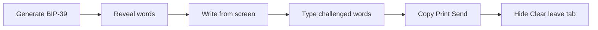

# Secret Kit — Keys tab seed write-down check

**Date:** 2026-09-11  
**Status:** written for review; implement after this spec is approved  
**Constraints:** no vault, nothing saved, loopback-only, `os.urandom` remains the CSPRNG, clipboard still clears after 60s. After ship: `bash scripts/build-all.sh`.

## Goal

After a BIP-39 generate on Keys, the user must prove they wrote the words down before Copy, Print, or Send to Derive can export them. Secret Kit does not keep a copy. A wrong notebook is unrecoverable.

## Non-goals (this pass)

- Full re-type of all 12 or 24 words.
- Shamir, SLIP-39, or any split backup.
- Gating hex, UUID, backup codes, or (later) SSH/age.
- A new HTTP API that sends the mnemonic back to Python for checking.
- Changing entropy policy, Derive, or Verify.
- Embedding CPython, Windows `.exe`, or Apple notarization.

---

## 1. When the check runs

Only `key-type === "seed"` after a successful generate.

Hex / UUID / backup codes keep today’s behavior: result is visible, Copy / Print work immediately, Send to Derive stays hidden.



Current Keys seed flow in [ui/js/keys.js](ui/js/keys.js): Generate → `#seed-gate` (Reveal) → `#seed-body` (numbered list + Copy / Send / Print / Hide / Clear). This spec inserts a confirm step between Reveal and export.

---

## 2. States

Keep `SK.keys.revealed` as today. Add `SK.keys.confirmed` (boolean, default `false`). Add `SK.keys.challenge` (array of 1-based word indexes, or `null`).

| State | Word list | Challenge form | Copy / Print / Send | Hide / Clear |
| --- | --- | --- | --- | --- |
| Generated, not revealed | hidden (`#seed-gate` up) | hidden | disabled / hidden with the body | Clear only (gate has Reveal) |
| Revealed, not confirmed | visible | hidden; primary **I wrote these down** is shown | **disabled** | Hide and Clear enabled |
| Confirming (quiz up) | **hidden** | visible | **disabled** | Clear enabled; Hide is hidden or no-ops (words are already hidden) |
| Confirmed | visible | hidden | **enabled** | Hide and Clear as today |

Hide after confirm works as today (toggles the numbered list). Confirm stays `true` until wipe. Hide does not re-lock export.

---

## 3. Challenge shape

**Count:** 3 distinct positions for a 12-word seed; 4 for a 24-word seed.

**How they are chosen:** in the UI, after Reveal, when the user first clicks **I wrote these down**. Shuffle `1..N` with `SK.shuffleIndexes(n)` using `crypto.getRandomValues` (this is which words to *ask*, not key material; `Math.random` is not used). Store the chosen indexes on `SK.keys.challenge`. Do not re-roll on a failed attempt. Re-roll only if they click **Show words again** and then **I wrote these down** a second time (new draw).

**Display order:** the order of the draw, not sorted. Labels are `Word 7`, `Word 2`, … (1-based, matching the numbered `<ol>`).

**Inputs:** one text field per position, `autocomplete="off"` `spellcheck="false"`, not a password field (they are checking a paper note). Submit with button **Confirm written down** and Enter in the last field.

**Match rule:** trim, collapse internal whitespace, lowercase. Must equal the mnemonic word at that index exactly (full BIP-39 word, no prefix). Empty field fails. Comparison is all-or-nothing: one error string, do not highlight which index was wrong.

**Error copy:** `Those words do not match. Check your notes and try again.`

**Retries:** unlimited. The seed stays in memory. Failed attempts do not wipe.

**Show words again:** on the quiz card, a secondary button returns to “Revealed, not confirmed”: word list visible, export still disabled, challenge form hidden, `SK.keys.confirmed` stays false. The stored challenge may be discarded so the next **I wrote these down** draws new indexes.

---

## 4. Export gates

Buttons `#seed-copy`, `#seed-print`, `#seed-send`:

- While `lastKind === "seed"` and `confirmed === false`: `disabled` attribute set; click handlers return immediately if somehow fired.
- After confirm: remove `disabled`; handlers unchanged from today.
- Print body after confirm is the same numbered sheet as today (`01  word`, passphrase reminder line). Print does **not** include the challenge questions.
- Send to Derive still wipes Keys after moving the words ([ui/js/keys.js](ui/js/keys.js) `seed-send`).

Do not add a second Print that bypasses the quiz.

---

## 5. Wipe rules

`SK.wipeKeys` also sets `confirmed = false` and `challenge = null`, clears `#seed-confirm-fields`, hides `#seed-confirm`, re-disables export buttons.

Wipe still happens when:

- Clear
- Leaving the Keys tab ([ui/js/core.js](ui/js/core.js) `SK.switchTab`)
- Generate again (existing generate handler already replaces `SK.keys.last`; it must reset confirm/challenge before showing the new gate)
- Send to Derive (already calls `wipeKeys`)

Nothing is written to disk. Confirmed is session memory only.

---

## 6. UI markup

In [ui/index.html](ui/index.html), inside `#seed-body`, **above** `.actions`:

```html
<button type="button" class="primary" id="seed-wrote">I wrote these down</button>
<div id="seed-confirm" class="hidden">
  <p class="hint label-row">Type the requested words from your paper notes.
    <button type="button" class="help-q" data-help="keys.confirm" aria-label="What is this">?</button>
  </p>
  <div id="seed-confirm-fields"></div>
  <div class="actions">
    <button type="button" class="primary" id="seed-confirm-run">Confirm written down</button>
    <button type="button" id="seed-show-again">Show words again</button>
  </div>
  <p class="error hidden" id="error-seed-confirm"></p>
</div>
```

`#seed-wrote` is visible only in “Revealed, not confirmed”. It is hidden on the quiz card and after confirm.

CSS in [ui/app.css](ui/app.css): disabled Copy / Print / Send look muted (opacity + `cursor: not-allowed`). Challenge inputs use existing `.field` / `.secret` patterns. No new theme.

---

## 7. Help copy (locked)

**`keys.confirm`**  
What: After you write the seed on paper, Secret Kit asks for a few word numbers to check the notes. Copy, print, and Send to Derive stay off until this passes.  
Why: This program does not keep a copy. If the notebook is wrong, those coins are gone.

**`keys.reveal`** — keep existing copy. Do not claim that Reveal already checks the backup.

**`keys.send`** — keep existing copy. Send remains unavailable until confirm.

---

## 8. Engine / tests

No new generate API fields. Checking stays in the UI so the mnemonic is not posted a second time.

Add a tiny pure helper in [ui/js/keys.js](ui/js/keys.js) (or a new `ui/js/seedcheck.js` loaded before `keys.js`):

- `SK.shuffleIndexes(n, k)` → `k` distinct integers in `1..n`
- `SK.seedAnswersMatch(mnemonic, answers)` where `answers` is `[{index: 7, word: "abandon"}, ...]` → boolean

Python unittest cannot run that JS. Cover the match rules with a **Python twin** used only in tests, not on the HTTP path:

- Create `engine/seedcheck.py` with `answers_match(mnemonic, answers)` implementing the same trim / lowercase / exact-word rule.
- Create `tests/test_seedcheck.py`: 12-word happy path; wrong word fails; prefix `aban` fails; mixed-case `Abandon` passes; empty word fails; 3 vs 4 count is a UI concern (not this function).

Do not call `engine/seedcheck.py` from `generate` or `http_server`. If JS and Python twins drift, that is a review catch, not a runtime coupling.

There is no JS test runner in this repo. Manual acceptance (below) is required for the gate and shuffle.

---

## 9. Files (expected)

| File | Role |
| --- | --- |
| `ui/index.html` | `#seed-wrote`, `#seed-confirm`, error node |
| `ui/js/keys.js` | states, shuffle, gates, handlers |
| `ui/js/help.js` | `keys.confirm` |
| `ui/js/boot.js` | include `seedcheck.js` only if split out |
| `ui/app.css` | disabled export buttons |
| `engine/seedcheck.py` | `answers_match` twin for tests |
| `tests/test_seedcheck.py` | match-rule tests |
| `README.md` | one clause on Keys: write-down check before copy/print/send |

No new persistence. No Docker bind change.

---

## 10. Acceptance

- Generate 12-word seed → Reveal → Copy / Print / Send do nothing (disabled). Word list is visible.
- **I wrote these down** hides the list and shows 3 labeled fields.
- Wrong words: error, still disabled, words stay hidden.
- **Show words again**: list returns, still disabled.
- Correct 3 words: list returns, Copy copies the phrase, Print shows the numbered sheet, Send moves words to Derive and wipes Keys.
- Generate 24-word seed: quiz asks 4 positions.
- Hex generate: no quiz; Copy works immediately.
- Leaving Keys then returning: seed is gone (existing wipe); no leftover confirm UI.
- `python3 -m unittest discover -s tests` stays green.
- After merge: `bash scripts/build-all.sh` on a machine that can build.
